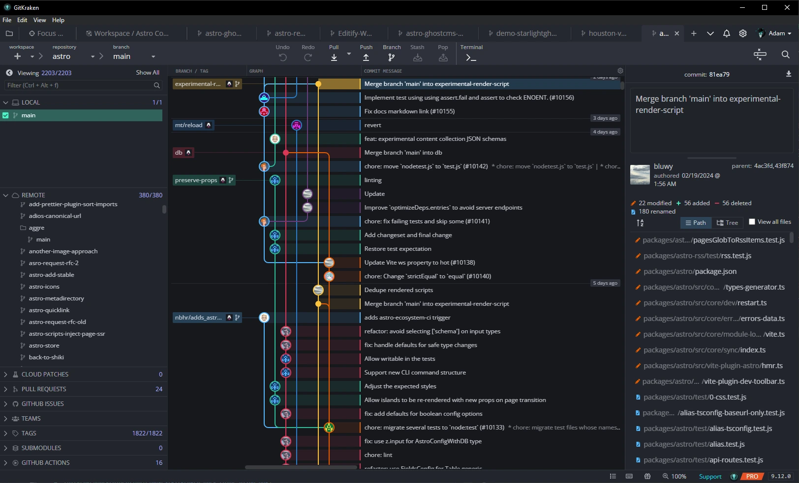

import MXYZRepo from '../../../components/MXYZRepo.astro'
import { Card, LinkCard, Icon } from '@astrojs/starlight/components';

<MXYZRepo title="@matthiesenxyz/gitkraken-houston" githubIntegrationURL='https://github.com/MatthiesenXYZ/gitkraken-houston/'/>

*Give your GitKraken client a whole new look with Astro's Houston!*

Do you love the look of the Houston theme? Now you can have it in your GitKraken client!  Just follow the simple steps on the GitHub repo to install the Houston theme in GitKraken.

Currently Houston only has a Dark Theme, so this will only work with the Dark Theme in GitKraken.

<Card title="Getting Started" icon="rocket">
   <LinkCard 
      title="Want to get started?  Check out the GitKraken-Houston Documentation"
      href="https://github.com/MatthiesenXYZ/GitKraken-Houston/"
   />
</Card>